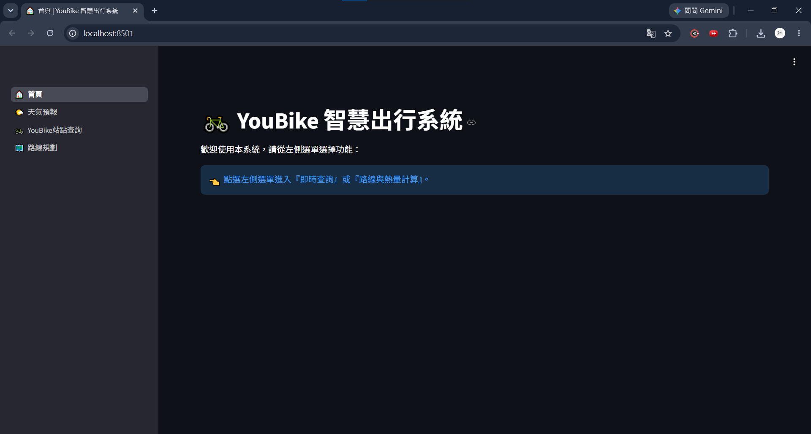

# 🚲 YouBike 智慧出行系統 (YouBike Smart Mobility System)

這是一套基於 Python 與 Streamlit 開發的 YouBike 2.0 即時查詢與路線規劃系統。旨在解決跨縣市 YouBike 騎乘時，因資訊破碎導致的「借還車困難」與「路徑規劃不精準」痛點。

系統整合了 YouBike 2.0 站點即時資訊、OpenStreetMap 地理資訊、Open-Meteo 天氣預報以及 OSRM 路徑規劃引擎，為使用者提供高效、直觀的 YouBike 出行決策支援。

## 💻 專案結構 (Project Structure)

```text
.
├── app.py                   # 系統入口與導覽
├── pages/
│   ├── home.py              # 首頁
│   ├── weather.py           # 氣象資訊視覺化
│   ├── station_query.py     # 即時站點數據與分析
│   └── route_planner.py     # 核心路徑演算法與熱量計算
├── utils.py                 # 工具函式與 API 介面封裝
├── data_collector.py        # 自動化爬蟲腳本 (資料庫初始化)
├── .streamlit/
│   └── config.toml          # 系統主題與 UI 設定
└── requirements.txt         # 依賴套件清單
```

## 🌟 核心亮點 (Project Highlights)

* **二階段搜尋演算法 (Two-Stage Search)**：為解決 API 延遲問題，開發兩階段搜尋：先以歐氏距離快速篩選候選站點，再呼叫 OSRM 進行精準路徑計算，大幅提升回應速度。
* **智慧借還推薦 (Smart Recommendation)**：整合站點即時車況與地理距離，設計 `final_score` 評分機制，自動推薦最符合效率的借還車站點。
* **視覺一致性 (Visual Consistency)**：透過 State Management 同步控制地圖圖層與 UI 主題，確保在深色模式下仍具備高辨識度。
* **自動化資料工程 (Automated Data Engineering)**：具備自動化初始化機制，首次執行時自動完成 SQLite 資料庫與站點資料同步。

## 🚀 功能總覽 (Features Overview)

* **全台站點即時查詢 (Real-time Station Query)**：自動抓取並儲存 YouBike 2.0 站點資料，支援按地區與站點名稱精確搜尋。
* **路徑規劃與熱量估算 (Route Planning & Calories)**：支援「步行」、「自備單車」、「YouBike」三種模式，依即時狀況動態規劃路徑，並依據使用者體重與路徑距離估算消耗熱量。
* **在地化資訊整合 (Local Weather Integration)**：查詢站點時，同步獲取該區域的即時天氣預報與降雨機率。
* **智慧借還推薦 (Smart Recommendation)**：透過距離、可用車輛數與空位數等多重指標，為使用者推薦最佳借車與還車站點。
* **互動式地理視覺化 (Interactive Visualization)**：使用 `PyDeck` 呈現動態地圖，支援根據螢幕主題自動切換深淺模式。

## 💡 技術堆疊 (Tech Stack)

* **前端框架 (Frontend Framework)**: [Streamlit](https://streamlit.io/)
* **地理視覺化 (Geo-Visualization)**: [PyDeck](https://pydeck.gl/) (deck.gl)
* **路徑運算 (Routing Engine)**: [OSRM](http://project-osrm.org/) (Open Source Routing Machine)
* **資料儲存 (Data Storage)**: SQLite (本地站點資料持久化)
* **地理搜尋 (Geo-Coding)**: Nominatim (OpenStreetMap)
* **天氣資訊 (Weather API)**: Open-Meteo API
* **資料分析 (Data Analysis)**: Pandas, Altair

## 🛠 安裝與執行
本專案建議在 [Anaconda](https://www.anaconda.com/download) 中建立的 Python 3.10+ 虛擬環境下執行。

### 1. 開啟終端機

請在 Anaconda Navigator 中開啟欲執行程式的虛擬環境的終端機，並切換至本專案目錄：
```bash
cd [本專案資料夾]
```
例如：
```bash
cd C:\Users\Jason\Desktop\Big-Data-Final
```

### 2. 安裝必要套件

執行以下指令，系統將自動安裝所有依賴套件：

```bash
pip install -r requirements.txt
```


### 3. 啟動系統

執行以下指令即可啟用前端：

```bash
streamlit run app.py
```

初次啟用會出現以下歡迎訊息，直接按 enter 跳過即可：

```bash
      Welcome to Streamlit!

      If you'd like to receive helpful onboarding emails, news, offers, promotions,
      and the occasional swag, please enter your email address below. Otherwise,
      leave this field blank.

      Email: 
```

啟用完成會獲得一個 `Local URL` 與一個 `Network URL`：
* **Local URL**：僅限本機端存取。
* **Network URL**：同一區域網路（WiFi/網線）的裝置皆可存取。

```bash
2026-06-02 22:08:25.909 Uvicorn server started on 0.0.0.0:8501

  You can now view your Streamlit app in your browser.

  Local URL: http://localhost:8501
  Network URL: http://192.168.1.124:8501
```

使用瀏覽器訪問網址即可開始使用：


---


*Developed by 王瑋琮 Wei-Tsung Wang (Jason) | NTUST CSIE B11330046*
